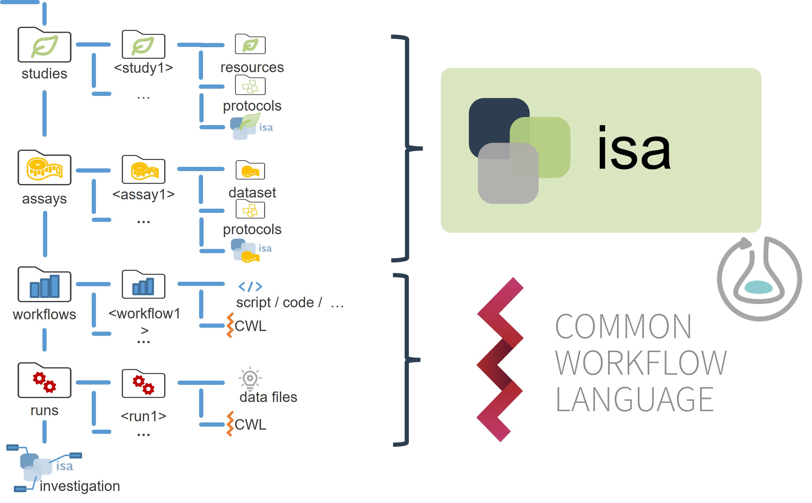

# Annotated Research Context

The importance of [Research Data Management (RDM)][kb-ResearchDataManagement] systems steadily increases, as scientists and institutions generate big, heterogeneous data nowadays. According to the [FAIR principles][kb-FairDataPrinciples] such data should be available in open, public archives, stored in contextualized, non-proprietary formats. With the **Annotated Research Context** (ARC), DataPLANT provides an RDM platform to answer these requirements and to support machine-readability, as the system is entirely based on established standards. ARCs will be tagged with a persistent and unique identifier and contain, besides raw data, the entire information (metadata, external files, and code for computations) needed to reproduce the mapped studies. These can range from a single publication up to a multi-lab, long-term project. Thus, ARCs are FAIR Digital Objects (FDOs) and drive FAIRification of research data for fundamental plant research.

## Data centric approach

The data-centric model is based on an architecture in which data is the primary and permanent asset and applications are interchangeable. Thus, the data model precedes the implementation of any given service and application, which are in a state of constant change to meet user requirements and experiences or functionality extensions.
To realize such a data centric approach for RDM in fundamental plant research, we propose the Annotated Research Context to capture and structure the complete research cycle meeting the FAIR requirements with low friction for the individual researcher. ARCs are self-contained and include assay or measurement data, workflow and computation results accompanied by metadata in one package. Their structure allows full user control over all metadata and facilitates usability, access, publication and sharing of the research. Thereby, ARCs are a practical implementation of existing standards encompassing the benefits of the **ISA model**, **Common Workflow Language (CWL)**, and **Research Object Crates (RO-Crate)**.
<!-- TODOs:
- add links to fundamentals on ISA, CWL, ROC
 -->
The ARC concept relies on a structure that partitions studies, assays, workflows, and runs for a granular reuse and development. Studies cover biological data, while assays cover experimental, and instrumental data, including their self-contained description using the ISA model. Similarly, workflows cover all computational steps of a study and contain application code, scripts, or any other executable description of an analysis ensuring highest flexibility for the scientists. To ensure persistence and reproducibility, these workflows comprise their own containerized running environment. The resulting data (runs) is linked to the workflows by a minimal Common Workflow Language file specifying the input and output of the process. The suggested structure for ARCs is a starting point for individual research projects and defines a framework for the organization, sharing, reuse, and evolution of research projects in a fashion familiar from open-source software development (see also [Data Sharing][kb-DataSharing]).

This results in standardized RDM procedures being process-oriented, meaning that each tool realizes or supports the researcher in a distinct task within the RDM cycle. As a consequence, this enables the desired mixed mode of application, in which both human and machine can operate processes simultaneously or asynchronously while avoiding technological barriers.

Figure 1: Basic ARC folder structure.

## Technical implementations

### Framework

Every ARC follows a distinct scheme with a specific directory and file structure, including the sub-directories "studies", "assays", "workflows", and "runs".

Studies are collections of material and resources used within the investigation. You need to place each study in a unique subdirectory. Material or experimental samples, as well as external data files, can be stored as virtual sample files (containing unique identifiers) in the "resources" directory. To describe the sample or material creation process, protocols can be stored in the designated sub-directory.

Assays correspond to outcomes of experimental assays or analytical measurements and are treated as immutable data. Each assay is a collection of files stored in a single directory, including corresponding metadata files. Assay data files, as well as protocols, are placed in a subdirectory individually.

Workflows in ARCs represent processing steps used in computational analyses and other data transformations of studies and assays to generate run results. Typical examples include data cleaning and preprocessing, computational analysis, or visualization.
We highly recommend to include a reproducible execution environment description in form of a Docker container description for tool descriptions.
<!-- TODOs: add link to Docker -->
Runs in an ARC represent all artefacts that derive from computations on assay and external data. Plots, tables, or similar results, specific to certain runs need to be saved in a subdirectory of the top-level "runs" directory.

Detailed information can be found in the official [ARC Specification][gh-ArcSpecs].
<!-- TODOs:
- there's quite some redundancy between the previous two paragraphs
 -->
### Collaborative work and versioning

ARCs are based on the lightweight and decentralized version-control system [git][kb-VersionControlGit]. Thereby, every ARC contains its entire previous versions and is shipped together with them. Distribution and management of access rights is accomplished via DataPLANT’s GitLab instance functioning as [DataHUB][kb-DataHub]. The git extension Git LFS takes care of files with a size of >100 Mb, as it stores the files in a separate location to avoid long synchronization times and creates a pointer file in the repository to establish a connection.
Git (LFS) also ensures integrity of your data, as all objects in git are accessed using the SHA-1 hash function. Changing the content of a file thereby also results in a change of the checksum. This prevents corruption of files, as Git will return an error if some data cannot be found based on its checksum (see also [git][kb-VersionControlGit]).
<!-- TODOs: move some git details to git article and rather link here -->

## ARC features & prospects

### Single point of entry logic

Once an ARC is filled, it should be able to target and interact with multiple platforms and services for research data management and computation. ARCs are stored on DataPLANTs DataHUB (GitLab), which enables collaborative work and version control immediately after initiation. Currently developed converters will be able to extract, transform, and validate metadata within an ARC to established standards like the Research Object Crate (RO-Crate) and facilitate an automatic upload to desired domain-specific [endpoint repositories][kb-PublicDataRepositories] (such as GEO, MetaboLights, or PRIDE). Reproducible and transparent analyses are furthermore supported by connectivity to the workflow management system Galaxy.  

### Data provenance & integrity

With our platform, data can be stored and jointly used prior to final submission. This allows wet lab scientists, (measurement) facilities, and bioinformaticians to add and logically connect their contributions to existing projects. Git's versioning capability allows to trace each step at any time, preserving the provenance of each contribution. This could result in a shift from project-oriented to scientist-centered publications, while the context of the investigation remains the same.

### Identification & searchability

ARCs will receive a unique and persistent identifier, which enables referencing in publications and grants or on service platforms. Furthermore, with the use of a metadata registry, researchers will be able to query databases for distinct terms for all ARCs they have access to, including public ARCs, their own ARCs and ARCs they were invited to for collaboration. These queries can range from project names and involved scientists down to single methods and even single datasets present in an ARC.

### ARC publications

Today, investigations are oftentimes published with the minimal information needed, such as protocols or raw datasets. Researchers interested in said studies carefully need to comprehend carried out processes and manually set up computations trying to reproduce and reuse published results. We envision to facilitate and extend data publications with the possibility to automatically replicate results by shipping the code with the respective data. In the future, ARCs should contain a blueprint in form of an executable workflow and run description that allows for auto-processing of data to generate results present in a distinct publication.

## How does DataPLANT support me in producing ARCs?

The following table gives an overview about DataPLANT tools and services supporting you in creating your own ARC. Follow the link in the first column for details.

Name | Type | Tasks on metadata
----------------|-----------|------------------
**[DataPLANT's QuickStart on ARCs][kb-QuickStart_arc]**   | Document | **Tutorial:** <ul><li>How to initialize an ARC<li>How to package data with metadata</li></ul>
**[Swate][gh-Swate]**   (Swate Workflow Annotation Tool for Excel) | Tool | **Collect and structure:** <ul><li>Annotate experimental and computational workflows with ISA metadata schema</li><li>Easy use of ontologies and controlled vocabularies</li><li>Metadata templates for versatile data types</li></ul>
**[ArcCommander][gh-ArcCommander]** | Tool | **Collect, structure and share:** <ul><li>Add bibliographical metadata to your ARC</li><li>ARC version control and sharing via DataPLANT's DataHUB</li><li>Automated metadata referencing and version control as your ARC grows</li></ul>
**[DataHUB](DataHub.html)** | Service | **Share:** <ul><li>Federated system to share ARCs</li><li>Manage who can view or access your ARC</li></ul>
**Invenio** | Service under construction | **Share:** <ul><li>Assign a DOI to an ARC</li></ul>
**Metadata registry** | Service under construction | **Share:** <ul><li>Find ARC (meta)data</li></ul>
**Converters** | Tool under construction | **Curate:** <ul><li>Harmonize and migrate between metadata schema

<!-- TODOs

- Replace SWATE link with KB link (once available)
- Replace arcCommander link with KB link (once available)
- Add KB-converter link (once available)
- Add KB-metadata_registry link (once available)
- reference KB-DataFormats and link to it 
-->

## Sources and further informmation

- [ISA model](https://isa-specs.readthedocs.io/en/latest/isamodel.html)
- [Common Workflow Language](https://www.commonwl.org/)
- [Research Object Crate](https://www.researchobject.org/ro-crate/)

<!-- Knowledge base cross-references -->

[kb-VersionControlGit]: ./VersionControlGit.html "Git"
[kb-DataHub]: ./DataHub.html "DataPLANT DataHUB"
[kb-FairDataPrinciples]: ./FairDataPrinciples.html "FAIR Data principles"
[kb-QuickStart_arc]: ./QuickStart_arc.html "Quickstart ARC"
[kb-PublicDataRepositories]: ./PublicDataRepositories.html "Repositories"
[kb-ResearchDataManagement]: ./ResearchDataManagement.html "Research Data Management"
[kb-DataSharing]: ./DataSharing.html "Data Sharing"

<!-- DataPLANT web links -->

[gh-ArcSpecs]: <https://github.com/nfdi4plants/ARC-specification/> "ARC specifications"
[gh-ArcCommander]: <https://github.com/nfdi4plants/arcCommander/wiki> "ArcCommander Wiki"
[gh-Swate]: <https://github.com/nfdi4plants/Swate/wiki> "Swate Wiki"

<!-- Reference web links -->