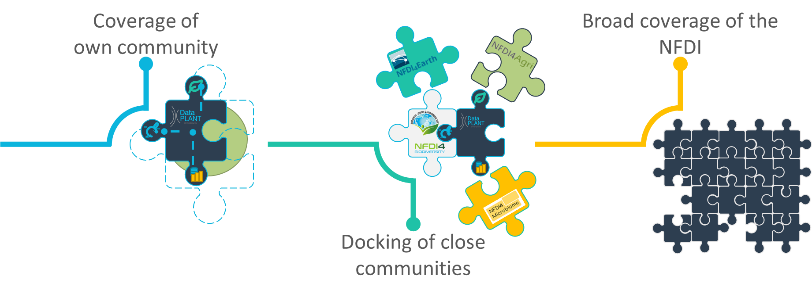

📣 [Find the recordings here](https://www.youtube.com/watch?v=VTGhtQmn2p4)

DataPLANT presented in the second event of the NFDI Talks online series on considerations on project sustainability and community expansion as the total number of researchers covered by the NFDI in Germany should be steadily expanded in the course of the formation process. Additionally the consortia should provide concepts for a long-term perspective after the first funding phase. The ongoing procedures for the formation of new consortia as well as the activities within the already funded consortia contribute to this. A central task of the consortia is to extend their visibility to the entirety of their research communities. Only in this way can they credibly represent their respective fields and establish common standards and concepts. One of the success criteria for the funded consortia is to penetrate their own community as completely as possible and to network with other research areas. For this, a coordinated process for onboarding should be agreed upon, how new members formally join a consortium and how they are integrated into the governance structure.

In addition, a long-term perspective of financial sustainability should be developed. This can be achieved in part through the design of future funding. A complementary path lies in greater involvement of the entire scientific community through the application process for DFG funding and the joint design of data management plans. Consultation with the NFDI could ensure that new projects work according to current workflows, with modern tools and jointly established standards, and that this is supported in the project process by the NFDI. Such support should function independently of the concrete funding progress of the individual NFDI consortia and the initial group of co-applicants and participants. For practical implementation, this could be realized, for example, through a co-applicant role of the respective technical consortium. This avoids questions about potential VAT liability of the supporting consortium through personnel and infrastructural contributions. (DFG: "As far as the financial side is concerned, the point to be clarified in particular is the extent to which consortia can offer services in return for payment without becoming liable to VAT and thus losing their non-profit status.")

[{width=100%}](https://www.youtube.com/watch?v=VTGhtQmn2p4)

Strategic considerations of sustainable development include recommendations and guidelines that should be given to future research and collaborative projects. Specialized science projects in virtually all disciplines typically require advice and support in the various aspects of data management, handling tools and workflows, and technical infrastructure. To be able to respond flexibly in this regard, a significant amount of staff should be allocated to support these communities through data stewards. This support for the co-applicants is already arranged by the DataPLANT consortium according to their needs, but in addition, research groups joining later should also benefit from the NFDI. Therefore, it needs to be discussed what conditions and commitment should be attached to inclusion and, in particular, how the human and infrastructural resources needed to support the new groups can be generated.

A conceivable approach for the future would be that newly submitted research proposals can apply for funds for support services in personnel or infrastructural form, comparable to INF subprojects in SFBs, which, if approved, flow directly to the NFDI or the assigned consortium. This allows in particular to deal well with partial positions - small projects cannot always apply for full positions for data management. It also ensures the sustainability and continuity of the experts employed by the NFDI. Recruitment and training of suitable personnel and follow-up employment after the end of the project are often unsolved challenges in the science enterprise, especially for a demanding range of tasks, such as data stewards.

Participation of the researchers and involvement of the communities in the design of such processes can be ensured via the committees in the individual consortia and the NFDI association. In this way, such an approach can be coordinated with the relevant stakeholders, so that a clear procedure can be established without setting up duplicate structures. Thus, DataPLANT has already started to work together with the TRR175 and Cluster of Excellence CEPLAS regarding a close cooperation and coordination right after the start. Here, a close linkage with the INF project of the CRC and the data stewards of CEPLAS could already be established. Such considerations could potentially be expanded and further developed step by step for the entire NFDI.