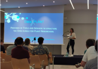
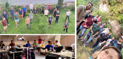
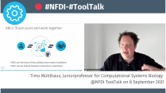
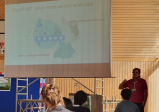
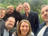

This September has been a busy month for the DataPLANT team. It started with a trip by our project coordinator [Cristina Martins Rodrigues](https://twitter.com/C_MRodrigues) to the [Chlamy 2020+1](https://chlamy2020.sciencesconf.org/). This is a biennial meeting of all groups working on *Chlamydomonas reinhardtii*. For the experts on the green alga, the RDM is also an important endeavour to act FAIR.  

[{width=60%}](https://twitter.com/nfdi4plants/status/1434876008038027270)

Back in Germany, the following week already brought joint work on DataPLANT Services as part of our 1st ARC Hackathon. Together we worked on the following topics:
* Creation of sample ARCs
* Ontology
* Raw data parser
* ARC common API and Converter
* ArcCommander special features

Besides the actual work, the event offered the opportunity to finally meet at least some of the DataPLANT colleagues in person. Taken together, the event was a complete success.

[{width=60%}](https://twitter.com/cs_biology/status/1435691196471549960)

Still at the hackathon, [Timo Mühlhaus](https://twitter.com/timo_muehlhaus) opened the new ToolTalks series of the [NFDI](https://nfdi.de) with a talk about the tools developed in DataPLANT. Unfortunately, you didn't have the time to attend? Find the [recording of the presentation on Youtube](https://www.youtube.com/watch?v=dOMNzY5rUlE). 

[{width=60%}](https://twitter.com/NFDI_de/status/1435911609222721545)

With the aim of taking the successes achieved straight into the community, Timo Mühlhaus and Cristina M. Rodrigues took part in the [MAdLand Annual Meeting 2021](https://4science.de/madland/). Not only the venue was breathtakingly beautiful, but also the talks like the [presentation](https://twitter.com/nfdi4plants/status/1438156038214127626) by [Mona Schreiber](https://twitter.com/SchreiberMona) 

[{width=60%}](https://twitter.com/nfdi4plants/status/1437829485299212297)

Last but not least, the collected impressions of not only September but the entire first year were gathered and transformed into a plan for the second year in the strategic DataPLANT-Meeting.

[{width=30%}](https://twitter.com/nfdi4plants/status/1443566532513054721)

We are looking forward to a successful second year! Let's be FAIR.

*Interesting Links:*

[Chlamy 2020+1](https://chlamy2020.sciencesconf.org/)

[NFDI](https://nfdi.de)

[MAdLand](https://madland.science/)

[Recording of the first NFDI ToolTalk](https://www.youtube.com/watch?v=dOMNzY5rUlE)

