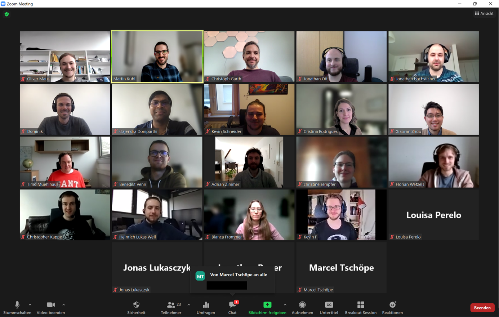

Today, 24 of DataPLANT developers and researchers came together to discuss the progress they made during the latest Hackathon on the [Annotated Research Context](https://github.com/nfdi4plants/ARC-specification/blob/main/ARC%20specification.md "ARC Specification") and its associated tools and services, which took place from 14th to 16th December. In the four-hour event, all participants had the chance to present their key findings or projects that evolved since then in a five-minute talk, followed by quick discussion. The presentations proved to be extremely lively, as some developers chose an interactive live demonstration to showcase their latest tools.  

Due to the ongoing Covid situation, the wrap-ups as well as the Hackathon had to be organized online. Nonetheless, both events were a great success and major 
progress was made in the areas of 

1) ARC structure and templates, 
2) Ontologies, 
3) ARC management and tooling, 
4) Findability and searching, 
5) Reproducibility and computational workflows, and 
6) Teaching. 

DataPLANT thanks all participants for their fruitful contributions and is looking forward to the next ARC Hackathon, where we hope to meet again in person. 

[{width=60%}](https://twitter.com/nfdi4plants/status/1488446901783564290?ref_src=twsrc%5Etfw)

